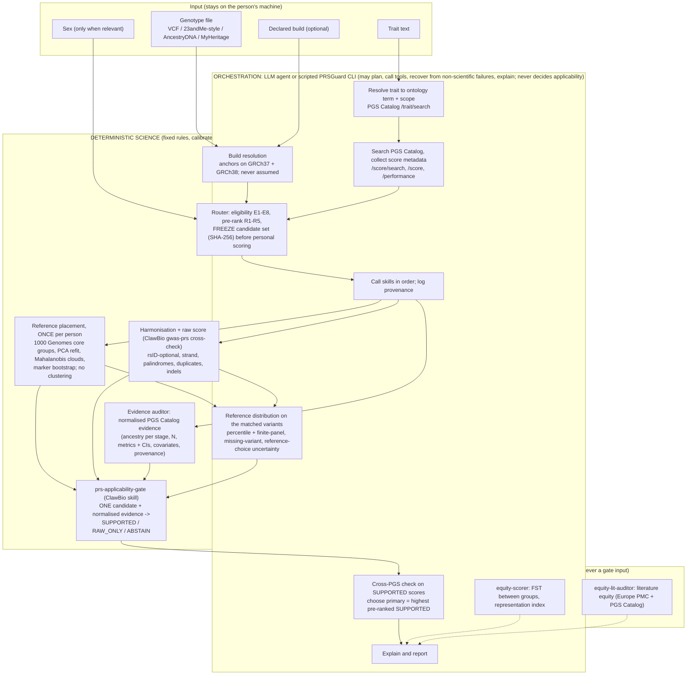

# Architecture

> Orchestration gathers evidence and calls tools. Deterministic code alone decides what claims are allowed.
>
> Orchestration = an **LLM agent** when one drives PRSGuard, otherwise the **deterministic scripted PRSGuard CLI
> orchestrator** (`prsguard run/demo/serve`). Results record which (`orchestration.kind`, `performed_by`). The
> scripted orchestrator is not an agent; both are bound by the same rules below.

## What each part may do

| Part | May | Must not |
|---|---|---|
| Orchestration (an LLM agent, or the deterministic scripted `prsguard` CLI orchestrator) | resolve traits, query the PGS Catalog and Europe PMC with trait text and PGS IDs, plan, retry transient failures, call skills, compare SUPPORTED scores, explain, report, log provenance | change thresholds or the config, re-run until SUPPORTED, pick a score by its personal result, invent or infer missing evidence, choose a reference population for a nicer result, convert a raw PRS into clinical or absolute risk, override the gate, send genotypes anywhere |
| Router | apply E1-E8 and R1-R5 to Catalog metadata; freeze with a digest | read the person's genotypes (only the build and the declared sex, which decide file availability and E3) |
| Placement | place the person once against fixed labelled references | cluster, pick k, call a bootstrap frequency an ancestry percentage, equate genetic placement with ethnicity or identity |
| Gate | decide SUPPORTED / RAW_ONLY / ABSTAIN for one candidate from normalised evidence | search, rank, infer ancestry, compute scores, choose a primary score, use randomness or the network |
| Context skills | describe representation and literature | feed any number into the gate |

## Modules

| Module | Role |
|---|---|
| `prsguard/catalog.py` | PGS Catalog client (rate-limited, retried), snapshot record/replay with SHA-256 manifest, metadata audit and normalisation (evaluation units = (publication, sample set) pairs, as the Catalog counts them) |
| `prsguard/router.py` | trait resolution and scope, eligibility, pre-ranking, freezing |
| `prsguard/genotypes.py` | genotype parsing (ClawBio parsers for array text files; VCF with REF/ALT kept) and build resolution |
| `prsguard/harmonize.py` | scoring-file parsing and variant matching |
| `prsguard/reference/` | 1000 Genomes panel extraction (`build.py`, `panel.py`), placement (`projection.py`), reference distributions (`distribution.py`) |
| `prsguard/evidence.py` | builds the gate input `prs-applicability-gate.input.v2` |
| `skills/prs-applicability-gate/` | the gate (ClawBio skill; `python clawbio.py run prs-gate`) |
| `prsguard/cross_pgs.py` | pairwise consistency and dependence between SUPPORTED scores |
| `prsguard/context.py` | equity-scorer FST/representation and gwas-prs cross-check (context) |
| `skills/equity-lit-auditor/` | literature equity (teammate skill; `python clawbio.py run equity-lit`) |
| `prsguard/pipeline.py` | the 10-step plan, result JSON, report, reproducibility bundle |
| `prsguard/server.py` | local-only API for the web interface (127.0.0.1) |
| `frontend/` | Next.js interface (static export; demo results; optional local server) |

## Why PRSGuard harmonises instead of calling gwas-prs for the raw score

ClawBio's `gwas-prs` matches by rsID only and does not resolve strand flips, strand-ambiguous SNPs, duplicates,
indels or position-only scoring files (PGS000004, the top-ranked breast cancer score, has no rsIDs). PRSGuard
therefore harmonises itself and re-computes the rsID-matchable forward-strand part of every score with
`gwas-prs.calculate_prs` as an independent cross-check (reported as context).

## Why an adapted reference projection instead of claw-ancestry-pca

`claw-ancestry-pca` runs PCA on a cohort VCF. PRSGuard needs one person placed against fixed labelled references
with uncertainty, on whatever subset of sites that person's file contains, so it refits the reference PCA on the
person's observed sites and projects them (no shrinkage from missing sites), with held-out calibration.
